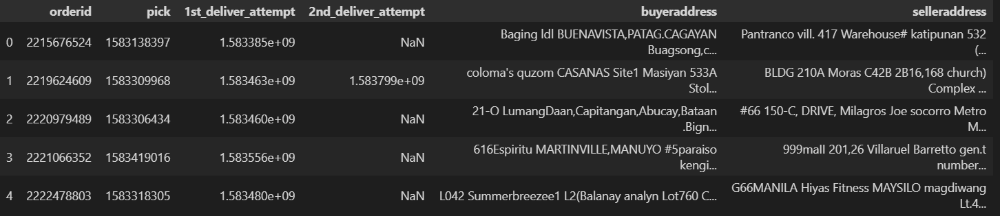
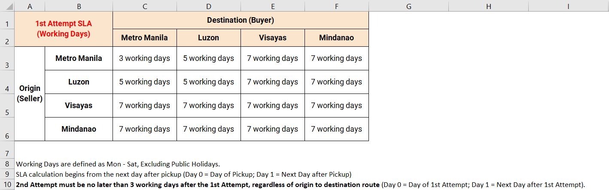

  <h2 align="center">Logistics Performance Analytics</h2>
  
   
  <a href="https://www.kaggle.com/competitions/logistics-shopee-code-league">Competition link</a> | 
  <a href="Guidelines.pdf">Complete PDF guideline</a> |
  <a href="LogisticsPerformanceAnalytics.ipynb">Solution</a>

<h3>Background</h3>

Due to the recent COVID-19 pandemic across the globe, many individuals are increasingly turning to online platforms like Shopee to purchase their daily necessities. This surge in online orders has placed a strain onto Shopee and their logistics providers but customer expectations on the timely delivery of their goods remain high. On-time delivery is arguably one of the most important factors of success in the eCommerce industry and now more than ever, Shopee needs to ensure the orders reach the buyers on time in order to build the users’ confidence in Shopee. 

In order to handle the millions of parcels that need to be delivered everyday, Shopee has engaged multiple logistics providers across the region. Only the best logistics providers that are able to meet Shopee’s delivery standards are partnered with them.

The performance of these providers is monitored regularly and each provider is held accountable based on the Service Level Agreements (SLA). Late deliveries are flagged out and penalties are imposed on the providers to ensure they perform their utmost. The consistent monitoring and process of holding Shopee's logistics providers accountable allows Shopee to maintain their promise of timely deliveries to their buyers.

<h3>Task</h3>

<ul>
<li>Identify all the orders that are considered late depending on the Service Level Agreements (SLA) with Shopee's Logistics Provider.
</li>
</ul>

<h3>Dataset</h3>

  delivery_orders_march.csv
    

  SLA_matrix.xlsx
    

