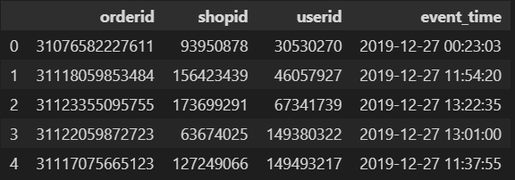

  <h2 align="center">Order Brushing Detection</h2>
  <a href="https://www.kaggle.com/competitions/students-order-brushing-1">Competition link</a> | 
  <a href="Guidelines.pdf">Complete PDF guideline</a> |
  <a href="OrderBrushingDetection.ipynb">Solution</a>

<h4>Tasks</h4>

<ol>
<li>Identify all shops that are deemed to have conducted order brushing.
</li>
<li>For each shop that is identified to have conducted order brushing, identify the
buyers suspected to have conducted order brushing for that shop.
</li>
</ol>

<h4>Data</h4>

  

