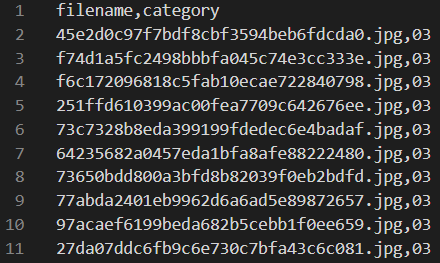
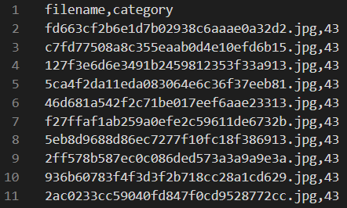
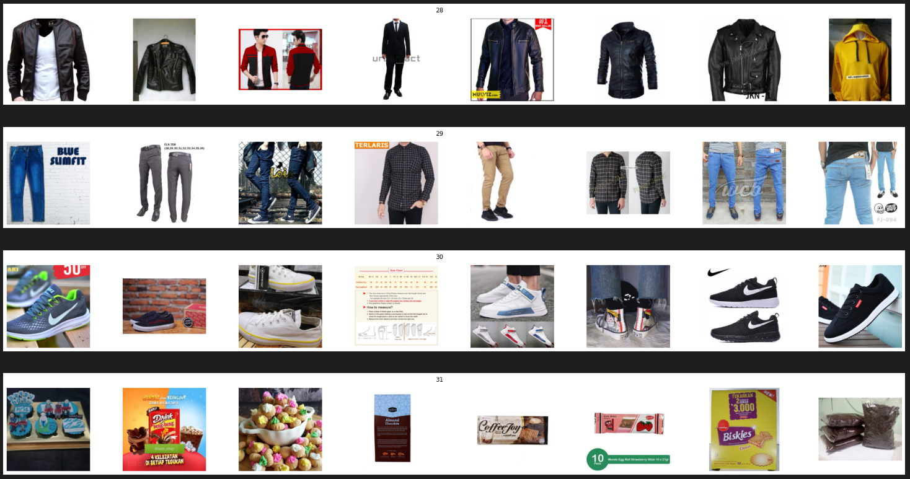

  <h2 align="center">Product Classification</h2>
  
  
   
  <a href="https://www.kaggle.com/c/shopee-product-detection-student">Competition link</a> | 
  <a href="Guidelines.pdf">Complete PDF guideline</a>

<h3>Background</h3>
E-commerce platforms like Shopee always strive to ensure the correct listing and categorization of products. Everyday Shopee needs to categorize a huge number of items. Therefore, a robust product classification system is needed to improve the listing and categorization efficiency. However, creating a robust product classification system is very challenging because real-world e-commerce images could be mis-labelled, highly imbalanced and have complex backgrounds and low-resolution.

<h3>Task</h3>

<ul>
<li>Build a 42-class image classification model to classify images of products on Shopee.
</li>
</ul>

<h3>Dataset</h3>

The dataset provided is the Shopee Product Detection Dataset. It contains more than 100,000 images which belong to the 42 most popular categories at Shopee.

* csv files:

  train.csv
   

 

  test.csv
   

 

* images:

  

<h3>Solution Outline</h3>

<ol>
    <li>
      <a href="ExploratoryDataAnalysis.ipynb">Exploratory Data Analysis</a>
      <ul>
        <li>Display images</li>
        <li>Explore class distribution</li>
        <li>Explore image dimension</li>
      </ul>
    </li>
    <li>
      <a href="Preprocessing.ipynb">Data Pre-processing</a>
      <ul>
        <li>Remove blank images</li>
        <li>Identify duplicated or highly similar images by using p-hashes</li>
        <li>Remove only duplicated images that belong to the same class</li>
        <li>Resample minority classes through image augmentation</li>
      </ul>
    </li>
      <li>
      <a href="Training.ipynb">Model Training (Transfer Learning)</a>
      <ul>
        <li>Instantiate a base model with pre-trained weights</li>
        <li>Freeze the base model</li>
        <li>Add layers on top of the base model</li>
        <li>Compile the model</li>
        <li>Train the model</li>
      </ul>
    </li>
    <li>
      <a href="Classification.ipynb">Classification of images</a>
      <ul>
        <li>Predict the classes of the images</li>
      </ul>
    </li>
</ol>
